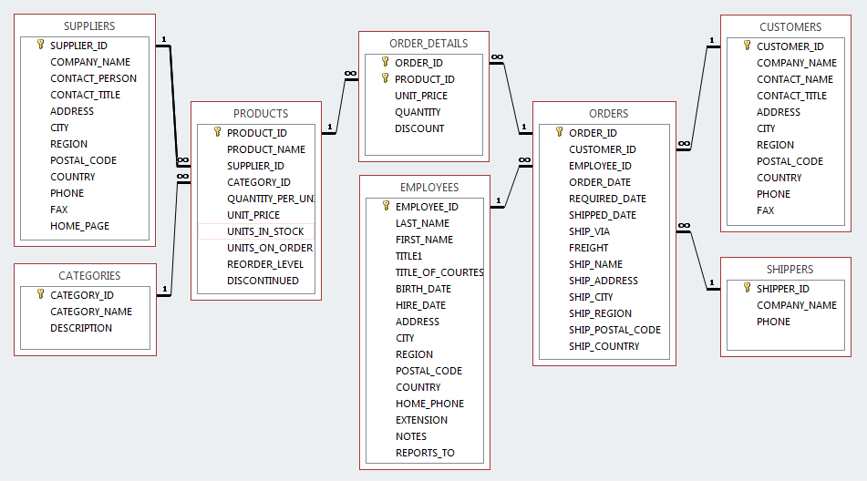
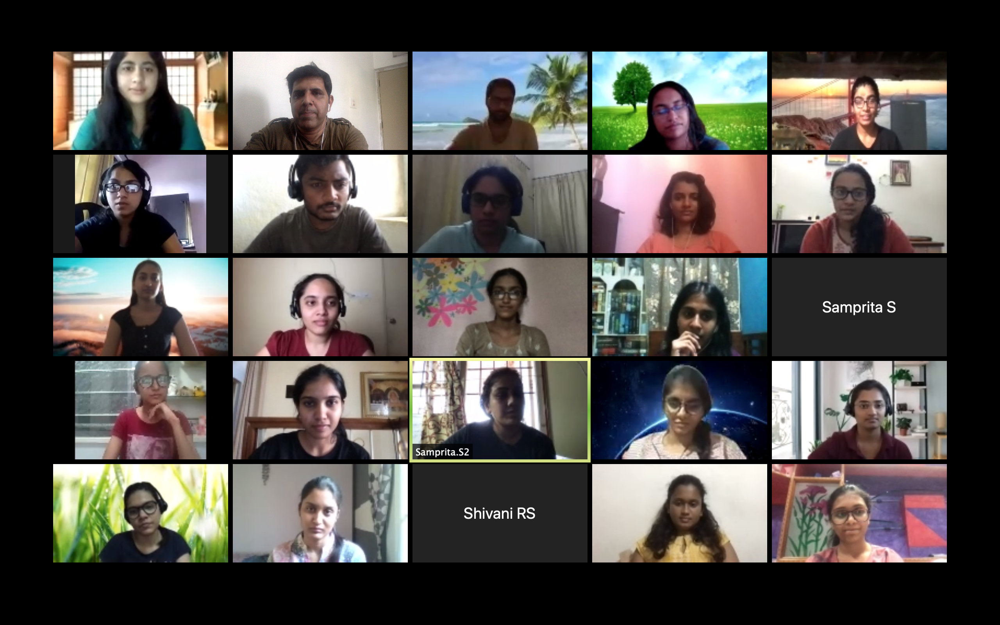
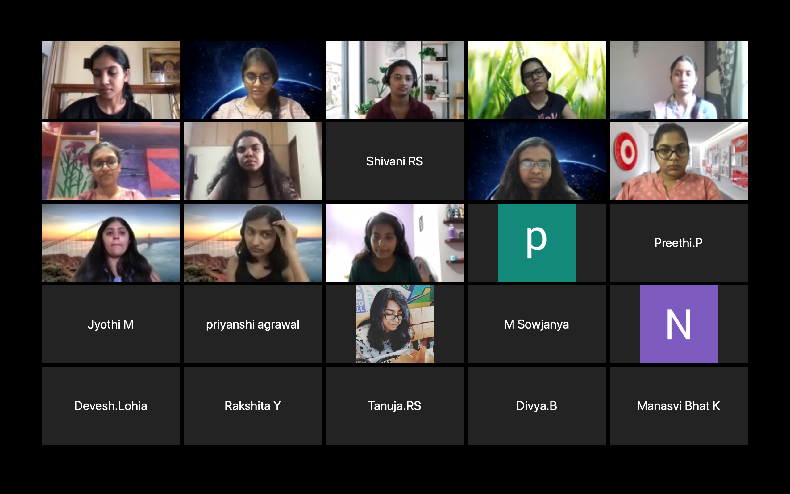

# Bootcamp training

Client: Target 
Duration: 15 days, 5 hours each day 
From: 10th August 2020 
Mode: Online/ Zoom 

<pre>
 _      _____   ___  ______  _   _      _    _  _____  _____  _   _      _   _  _____  _   _  _____ ______ 
| |    |  ___| / _ \ | ___ \| \ | |    | |  | ||_   _||_   _|| | | |    | | | ||_   _|| \ | ||  _  ||  _  \
| |    | |__  / /_\ \| |_/ /|  \| |    | |  | |  | |    | |  | |_| |    | | | |  | |  |  \| || | | || | | |
| |    |  __| |  _  ||    / | . ` |    | |/\| |  | |    | |  |  _  |    | | | |  | |  | . ` || | | || | | |
| |____| |___ | | | || |\ \ | |\  |    \  /\  / _| |_   | |  | | | |    \ \_/ / _| |_ | |\  |\ \_/ /| |/ / 
\_____/\____/ \_| |_/\_| \_|\_| \_/     \/  \/  \___/   \_/  \_| |_/     \___/  \___/ \_| \_/ \___/ |___/  
                                                                                                           
                                                                                   
Vinod Kumar Kayartaya
Software trainer, independent consultant and freelance developer.
https://vinod.co
vinod@vinod.co
+91 973 142 4784
</pre>

### Steps to run Angular project (Examples/northwind-dashboard)

1. Install `Node.js` (if not done already)
1. Install angular-cli [ `sudo npm install -g @angluar/cli` ]
1. CD into your angular project folder (For example:  `cd ~/Downloads/Examples/northwind-dashboard` )
1. Install the npm depdenencies [ `npm install` ]
1. Run the angular project [ `ng serve -o` ]

### Northwind Database 

### Team

